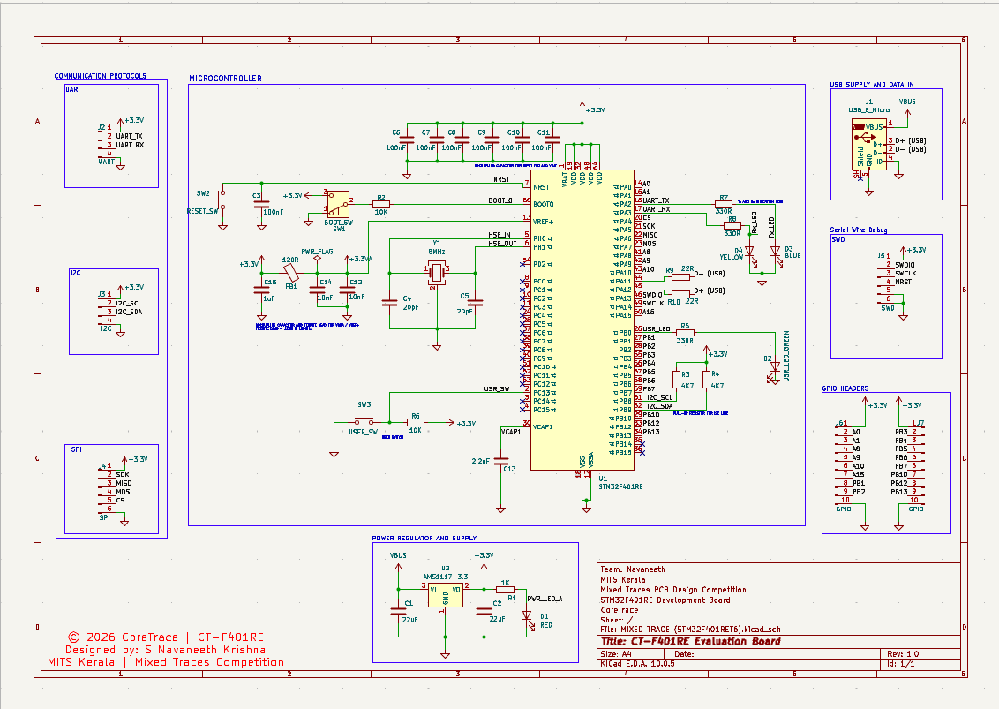
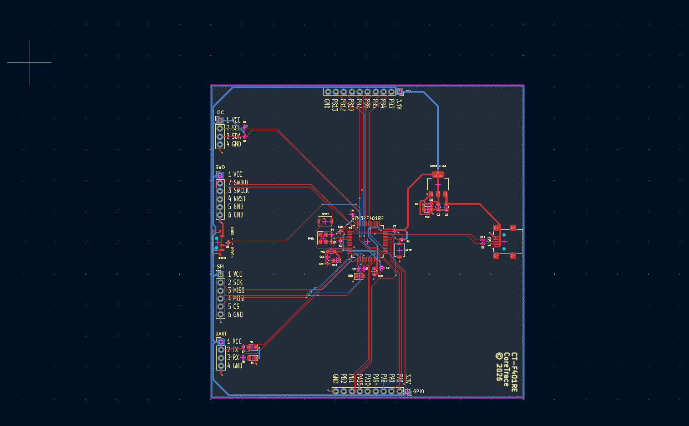
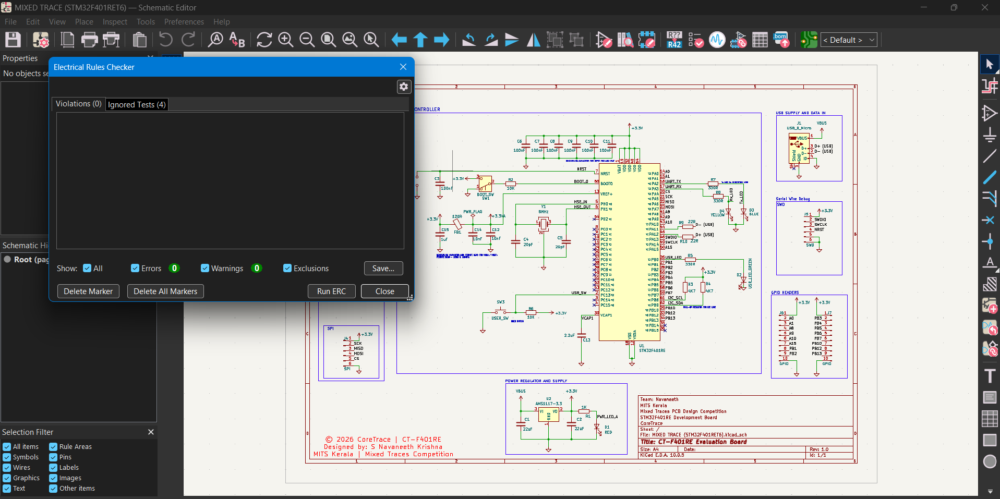
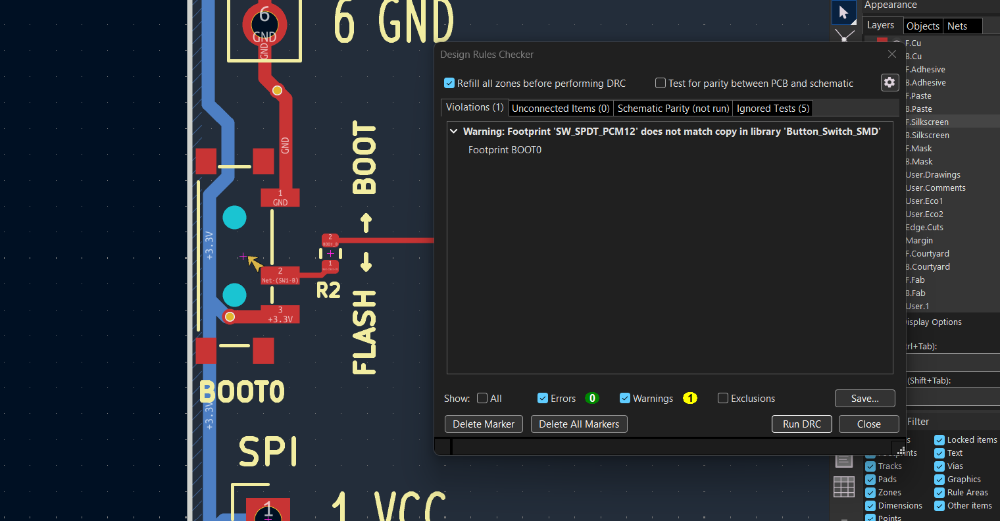

# CT-F401RE Evaluation Board
**Team:** CoreTrace  
**Designer:** S Navaneeth Krishna  
**Institution:** MITS Kerala  
**Competition:** Mixed Traces — MEC 2026  

## Overview
Compact STM32F401RET6 evaluation board 
inspired by NUCLEO-F401RE reference design.
Designed for Mixed Traces PCB Design 
Competition by Mixed Signals, MEC.

## Features
- STM32F401RET6 LQFP-64 MCU
- USB Micro-B interface
- SWD debug header (6-pin)
- UART, SPI, I2C communication headers
- 18 GPIO pins (CN1, CN2)
- 8MHz HSE crystal oscillator
- AMS1117-3.3 LDO voltage regulator
- 4 LED indicators (PWR/USR/TX/RX)
- Reset + User tactile buttons
- BOOT0 SPDT switch
- 100×100mm 2-layer PCB
- Designed in KiCad 10.0.5

## Design Decisions
- AMS1117-3.3 for 5V→3.3V regulation
- SMD components throughout
- 22Ω USB series resistors
- SPDT switch for BOOT0 selection
- Copper pour both layers
- Ferrite bead on VDDA supply
- VCAP1 = 2.2µF for internal regulator

## Design Status
- Schematic ✅ Complete
- ERC ✅ Clean (0 errors)
- PCB Layout ✅ Complete
- Routing ✅ Complete
- DRC ✅ Clean (0 errors)
- Silkscreen ✅ Complete

## Screenshots
### Schematic

### PCB Layout

### PCB 3D View

### ERC Results

### DRC Results

## Tools
- KiCad 10.0.5
- STM32F401RET6 datasheet
- NUCLEO-F401RE reference schematic

## Competition
Mixed Traces PCB Design Competition  
By Mixed Signals — Electronics Association of MEC  
September 2026
