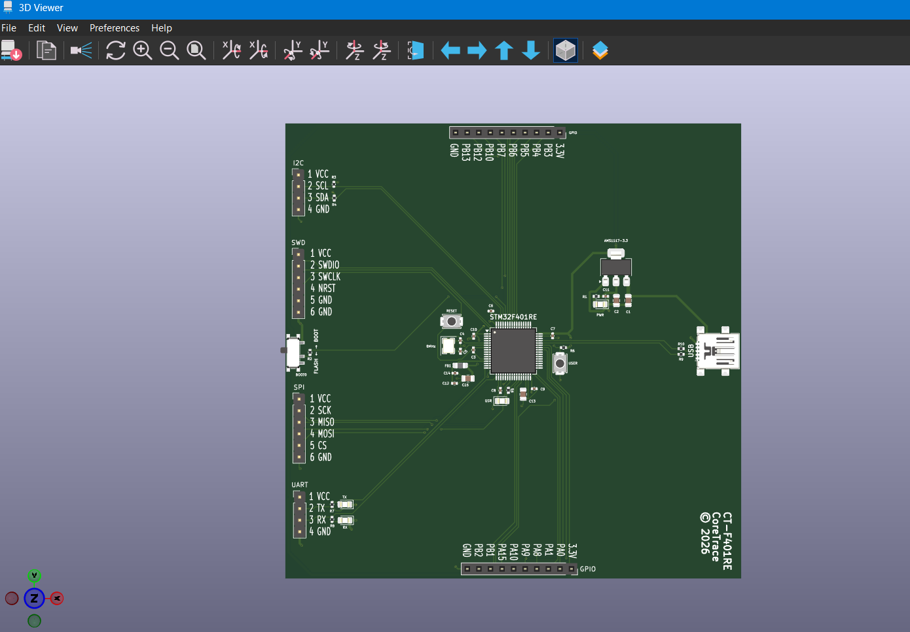
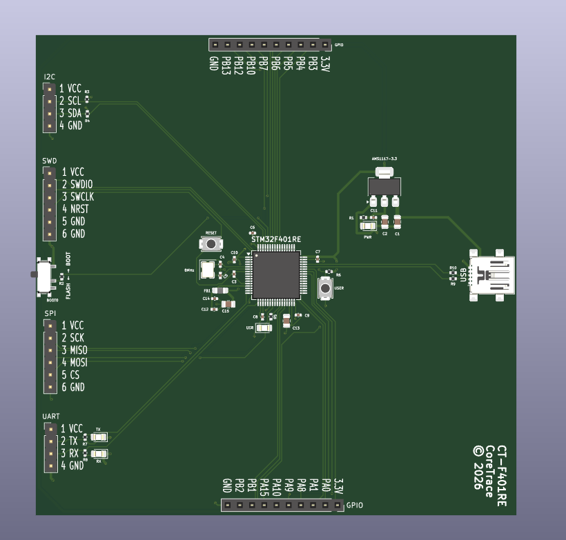

# CT-F401RE Evaluation Board
**Team:** CoreTrace  
**Designer:** S Navaneeth Krishna  
**Institution:** Muthoot Institute of Technology and Science (MITS), Kerala  
**Competition:** Mixed Traces PCB Design Competition — MEC 2026  

---

## Overview
CT-F401RE is a compact STM32F401RET6 evaluation and development board 
designed for the Mixed Traces PCB Design Competition organized by 
Mixed Signals, the Electronics Association of MEC. The board is 
inspired by the STM32 NUCLEO-F401RE reference design and provides 
essential facilities for programming, debugging, and general-purpose 
embedded development.

---

## Features
- STM32F401RET6 LQFP-64 microcontroller
- USB Micro-B interface for power and communication
- SWD debug and programming header (6-pin)
- UART communication header (4-pin)
- SPI communication header (6-pin)
- I2C communication header (4-pin)
- 18 GPIO pins exposed via CN1 and CN2 headers
- 8MHz HSE crystal oscillator
- AMS1117-3.3 LDO voltage regulator (5V → 3.3V)
- 4 LED indicators (PWR / USR / TX / RX)
- Reset tactile button
- User tactile button
- BOOT0 SPDT slide switch
- 100 × 100mm 2-layer PCB
- Designed in KiCad 10.0.5

---

## Design Decisions

### Power Supply
- AMS1117-3.3 LDO chosen for simplicity, availability and low cost
- USB Micro-B as power input via VBUS (5V)
- Bulk capacitors (22µF) on both input and output of regulator
- 100nF ceramic decoupling caps on all MCU VDD pins
- Ferrite bead (120R) on VDDA/VREF+ supply for analog noise filtering
- VCAP1 = 2.2µF for STM32F401RE internal voltage regulator stability

### USB
- 22Ω series resistors on D+ and D− for signal integrity
- Internal 1.5kΩ pullup on D+ for USB Full Speed detection
- USB Micro-B connector on board edge for easy access

### Clock
- 8MHz HSE crystal with 20pF load capacitors
- Crystal placed close to PH0/PH1 pins for short traces

### BOOT0
- SPDT slide switch for easy BOOT0 selection
- FLASH position → normal boot from flash
- BOOT position → bootloader mode
- 10kΩ pulldown resistor as default LOW state

### GPIO
- CN1 exposes: 3.3V, PA0, PA1, PA8, PA9, PA10, PA15, PB1, PB2, GND
- CN2 exposes: 3.3V, PB3, PB4, PB5, PB6, PB7, PB10, PB12, PB13, GND
- All unused PC pins assigned no-connect flags

### PCB
- SMD components throughout for compact layout
- 0402 package for resistors and small capacitors
- 0805 package for LEDs and bulk capacitors
- GND copper pour on both layers
- Track widths: 0.2mm signal, 0.3mm MCU power, 0.5mm 3.3V, 0.8mm VBUS

---

## Design Status

| Task | Status |
|---|---|
| Schematic | ✅ Complete |
| ERC | ✅ Clean (0 errors, 0 warnings) |
| PCB Layout | ✅ Complete |
| Routing | ✅ Complete |
| DRC | ✅ Clean (0 errors, 1 warning) |
| Silkscreen | ✅ Complete |
| BOM | ✅ Complete |
| Documentation | ✅ Complete |

---

## Known Issues and Warnings

### DRC Warning — Footprint Mismatch
**Warning:**    

**Component:** SW1 — BOOT0 SPDT Switch

**Reason:** The SPDT switch footprint was 
modified to fix a silkscreen overlap with 
the board edge cut. The silkscreen of the 
original footprint extended beyond the PCB 
boundary causing a DRC violation. The 
footprint silkscreen was moved inward 
resulting in a minor library mismatch warning.

**Impact:** None — footprint is electrically 
correct and physically accurate. This is a 
cosmetic library mismatch only.

**DRC Summary:**
| Type | Count |
|---|---|
| Errors | 0 ✅ |
| Warnings | 1 ⚠️ |
| Unconnected nets | 0 ✅ |

---

## Screenshots

### Schematic

### PCB Layout

### PCB 3D View

### PCB 3D View

### ERC Results

### DRC Results

---

## Bill of Materials (BOM)

| Component | Value | Package | Qty |
|---|---|---|---|
| STM32F401RET6 | MCU | LQFP-64 | 1 |
| AMS1117-3.3 | LDO Regulator | SOT-223 | 1 |
| Crystal | 8MHz | SMD 3225 | 1 |
| Capacitor | 22µF | 0805 | 2 |
| Capacitor | 2.2µF | 0805 | 1 |
| Capacitor | 1µF | 0805 | 2 |
| Capacitor | 100nF | 0402 | 6 |
| Capacitor | 10nF | 0402 | 2 |
| Capacitor | 20pF | 0402 | 2 |
| Resistor | 10kΩ | 0402 | 2 |
| Resistor | 4.7kΩ | 0402 | 2 |
| Resistor | 1kΩ | 0402 | 1 |
| Resistor | 330Ω | 0402 | 3 |
| Resistor | 22Ω | 0402 | 2 |
| Resistor | 1.5kΩ | 0402 | 1 |
| Ferrite Bead | 120R | 0805 | 1 |
| LED Red | PWR | 0805 | 1 |
| LED Green | USR | 0805 | 1 |
| LED Blue | TX | 0805 | 1 |
| LED Yellow | RX | 0805 | 1 |
| Tactile Switch | Reset | SMD | 1 |
| Tactile Switch | User | SMD | 1 |
| SPDT Switch | BOOT0 | SMD | 1 |
| USB Micro-B | Connector | SMD | 1 |
| Pin Header | 2.54mm 1×10 | THT | 2 |
| Pin Header | 2.54mm 1×06 | THT | 2 |
| Pin Header | 2.54mm 1×04 | THT | 2 |

---

## Tools Used
- KiCad 10.0.5
- STM32F401RET6 Datasheet
- NUCLEO-F401RE Reference Schematic (MB1136)
- STM32F401RE Reference Manual

---

## Competition Details
**Competition:** Mixed Traces PCB Design Competition  
**Organizer:** Mixed Signals — Electronics Association of MEC  
**Reference:** STM32 NUCLEO-F401RE (MB1136)  
**Submission Date:** September 2026  

---

*© 2026 CoreTrace — S Navaneeth Krishna — MITS Kerala*
